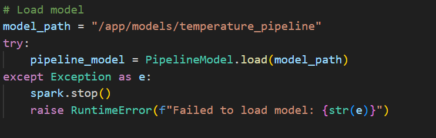

## What the Real-Time Project Does

1. We train ML model using LinearRegression algorithm  
   

2. The model is deployed in Apache Spark
   

3. The model predicts temperature as Spark processes data in real-time  
   

---

## Real-Time Backend Setup

### Manual Setup (Alternative)
For step-by-step instructions:  
[MANUAL_SETUP.md](./docs/MANUAL_SETUP.md)

### Recommended Method: Quick Start
Run the services:
```bash
1. docker-compose up -d --build
2. docker exec -it kafka1 kafka-topics --bootstrap-server kafka1:19093 --command-config /etc/kafka/secrets/client-ssl.properties --create --topic test-topic --partitions 10 --replication-factor 2
3. sudo chmod 777 models spark_checkpoints spark_work
4. docker exec -it spark spark-submit /app/code/train_ml_model.py
5. docker exec -it spark spark-submit /app/code/spark_processor.py
6. docker exec -it api python kafka_producer.py
7. docker exec -it postgresql psql -U admin -d taxi_db
8. docker-compose logs -f logstash  