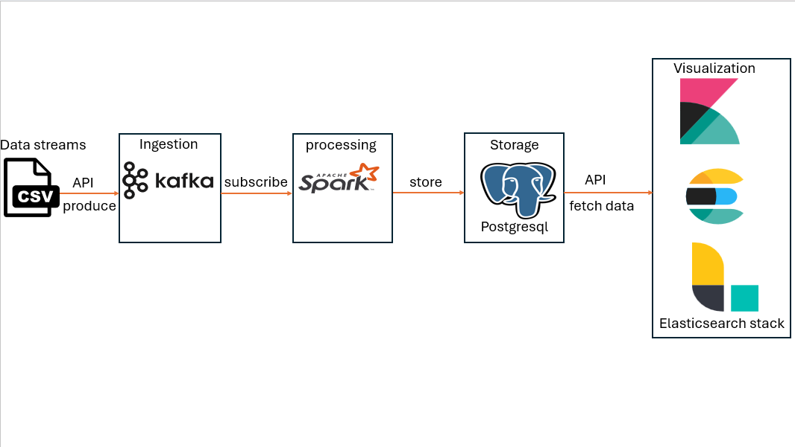

# Real-Time Temperature Prediction Pipeline
This project implements a complete real-time data pipeline for ingesting temperature sensor data, performing ML-based predictions, storing results, and serving them via a REST API. The stack leverages Apache Kafka, Apache Spark Structured Streaming, PostgreSQL, Elasticsearch, Logstash, Kibana, and FastAPI—all orchestrated with Docker Compose.

## Table of Contents
- [Overview](#Overview)
- [Architecture](#Architecture)
- [Components](#Components)
- [Prerequisites](#Prerequisites)
- [Setup & Configuration](#Setup-&-Configuration)
  - [SSL Certificates for Kafka](#SSL-Certificates-for-Kafka)
  - [Secrets](#Secrets)
- [How It Works](#How-It-Works)
  - [Data Ingestion](#Data-Ingestion)
  - [Stream Processing & ML Inference](#Stream-Processing-&-ML-Inference)
  - [Storage & Serving](#Storage-&-Serving)
  - [Visualization](#Visualization)
- [API Endpoints](#API-Endpoints)
- [Running the System](#Running-the-System)
- [Training the ML Model](#Training-the-ML-Model)
- [Monitoring & Health Checks](#Monitoring-&-Health-Checks)
- [Project Structure](#Project-Structure)
- [Contributin](#Contributing)
- [License](#License)

## Overview
The system ingests historical temperature sensor data `(temper_data.csv)` using a multi‑threaded Kafka producer. The data is then consumed by a Spark Structured Streaming job that cleans, transforms, and applies a pre‑trained Linear Regression model to predict temperature `(temp_c)` from features like `timestamp_epoch`, `temp_f`, and `device_id`. Predictions are stored in PostgreSQL. A FastAPI service exposes aggregated metrics (latest timestamp and temperature). Additionally, Logstash continuously syncs the predictions to Elasticsearch, where Kibana provides real‑time dashboards.

## Architecture



The pipeline consists of the following stages:
1- **Producer** `(kafka_producer.py)` – reads CSV data and publishes messages to Kafka `(test-topic)`.
2- **Kafka Cluster** – two SSL‑secured brokers for high availability.
3- **Spark Streaming** – consumes messages, parses JSON, applies ML model, writes predictions to PostgreSQL.
4- **PostgreSQL** – persists predictions in table `temperature_predictions`.
5- **Logstash** – periodically reads from PostgreSQL and indexes data into Elasticsearch.
6- **Elasticsearch + Kibana** – storage and visualization of predictions.
7- **FastAPI** – serves a REST endpoint `/aggregations` (currently returning static data; extendable to query PostgreSQL/Elasticsearch).

## Components

|Component	   |Container Name	      |Role                                      |
|--------------|-----------------------|------------------------------------------|
|Zookeeper	   |`zookeeper`	         |Kafka coordination                        |
|Kafka Brokers	|`kafka1`, `kafka2`	   |Message broker (SSL)                      |
|PostgreSQL	   |`postgresql`	         |Predictions storage                       |
|Spark Master	|`spark`	               |Streaming job master                      |
|Spark Worker	|`spark-worker`         |Worker node                               |
|FastAPI	      |`api`                  |REST API service                          |
|Elasticsearch	|`elasticsearch`	      |Search & analytics engine                 |
|Kibana	      |`kibana`	            |Dashboarding                              |
|Logstash	   |`logstash`	            |Data sync from PostgreSQL to Elasticsearch|

## Prerequisites
**Docker & Docker Compose** (version 3.8+)
**Git**
(Optional) Python 3.9+ for local testing
Make sure ports listed in `docker-compose.yml` are free on your host:
`12181` (Zookeeper)
`19091`, `19093`, `29092`, `29094` (Kafka)
`5432` (PostgreSQL)
`4040`, `7077`, `8080`, `8081` (Spark)
`8000` (API)
`9200`, `9300` (Elasticsearch)
`5601` (Kibana)
`9600` (Logstash)

## Setup & Configuration
#### SSL Certificates for Kafka
The Kafka brokers are configured with SSL (mutual TLS). All necessary certificate files are expected in the following paths (as mounted in `docker-compose.yml`):
`/home/uii0000/realtime-backend/kafka/...` – adjust these paths to your actual directory.
Important: Replace all host‑specific paths in the `volumes` section of `docker-compose.yml` with your own absolute paths. For example, change:
- /home/uii0000/realtime-backend/kafka/kafka-1-creds/...
to your own location, or place the certificates inside the project root and use relative paths.

#### Secrets
Sensitive credentials are managed via Docker secrets:
    `postgres_password` – read from `./secrets/postgres_password`
    `Truststore password` – read from `./truststore/truststore_creds` (mounted as a file)
Ensure these files exist before starting the stack.

## How It Works
#### Data Ingestion
The Python script `kafka_producer.py`:
    Reads the first 1,000,000 rows of `temper_data.csv` (a temperature dataset).
    Splits the data across two threads for parallel sending.
    Serializes each row to JSON and publishes to Kafka topic `test-topic` using SSL.
    Configures producer with acks=1, batching, and retries for throughput.
#### Stream Processing & ML Inference
`spark_processor.py` runs inside the Spark master container:
   1- Creates a Spark Session with PostgreSQL and Kafka dependencies.
   2- Reads from Kafka using SSL and a defined schema.
   3- Cleans the data (removes escapes, drops nulls, parses timestamp).
   4- Loads a pre‑trained PipelineModel from `/app/models/temperature_pipeline`.
   5- For each micro‑batch (every 5 seconds):
        Transforms the batch through the pipeline (vector assembler → linear regression).
        Selects `timestamp`, `actual_temp_c`, and `predicted_temp_c`.
        Writes the results to PostgreSQL table `temperature_predictions` using JDBC.

#### Storage & Serving
PostgreSQL stores all predictions persistently.
FastAPI (`api.py`) currently exposes a mock endpoint `/aggregations`. It can be extended to query PostgreSQL or Elasticsearch for aggregated stats (e.g., latest prediction, average error).

#### Visualization
Logstash runs a pipeline (defined in `logstash.conf`) that periodically queries PostgreSQL and indexes new records into Elasticsearch.
Kibana connects to Elasticsearch and allows you to build dashboards showing actual vs. predicted temperatures over time, error trends, etc.

## API Endpoints

|Endpoint	    |Method|Description
|---------------|------|-----------------------------------------------------------------------------------------------------------------|
|`/aggregations`|GET	  |Returns hard‑coded data: { `'timestamp_epoch': 1612656387, 'temp_c': 17.7 `}. (To be replaced with real queries.)|
|`/health`	    |GET	  |Used for health checks (defined in docker-compose.yml).                                                          |

## Running the System

1- **Clone the repository** and navigate to the project root.
2- **Prepare certificates and secrets** (see Setup & Configuration).
3- **Start all services:**
   ```bash
   docker-compose up -d
   ```
  This builds custom images for Spark, Logstash, and the API using the provided Dockerfiles.
4- **Wait for all services** to become healthy (check with docker-compose ps).
5- **Run the Kafka producer** to ingest data:
   ```bash
   docker-compose exec spark python /app/code/kafka_producer.py
   ```
  (Alternatively, run it from your host if you have Python dependencies installed.)
6- **Monitor the streaming job** in Spark UI:
Visit `http://localhost:4040` (Spark master UI) to see the streaming query progress.
7- **Check PostgreSQL** for predictions:
   ```bash
   docker-compose exec postgresql psql -U admin -d taxi_db -c "SELECT * FROM temperature_predictions LIMIT 10;"
   ```
8- **View Elasticsearch data:**
   ```bash
   curl -X GET "localhost:9200/_cat/indices?v"
   ```
9- **Open Kibana** at `http://localhost:5601` and create an index pattern for the Logstash index (e.g., `logstash-*`) to visualize the data.
10-**Test the API:**
   ```bash
    curl http://localhost:8000/aggregations
   ```
## Training the ML Model
The model is trained offline using `train_ml_model.py`:
  Reads `temperature_update.csv` (same schema).
  Splits into train/test (90/10).
  Builds a pipeline with `VectorAssembler` (features: `timestamp_epoch`, `temp_f`, `device_id`) and LinearRegression (label: `temp_c`).
  Saves the pipeline to `/app/models/temperature_pipeline`.
To retrain:
  ```bash
   docker-compose exec spark python /app/code/train_ml_model.py
   ```
After retraining, the streaming job will automatically load the new model on restart (or you can restart the container).

## Monitoring & Health Checks
Each service includes a health check defined in `docker-compose.yml`:
    **Zookeeper:** `nc -z localhost 12181`
    **Kafka:** `openssl s_client` verifies SSL connectivity.
    **PostgreSQL:** `pg_isready`
    **Spark:** custom script `health-check-spark.sh` (checks master and worker).
    **API:** `curl http://localhost:8000/health`
    **Elasticsearch:** `curl http://localhost:9200`
    **Logstash:** curl `http://localhost:9600`
You can monitor overall status with:
   ```bash
   docker-compose ps
   ```
## Project Structure
realtime-backend/
├── api.py                      # FastAPI application
├── docker-compose.yml          # Service orchestration
├── Dockerfile-api              # API container build
├── Dockerfile-logstash         # Logstash container build
├── Dockerfile-spark            # Spark container build
├── kafka_producer.py           # Data ingestion script
├── spark_processor.py          # Streaming + ML inference
├── train_ml_model.py           # Offline model training
├── logstash.conf               # Logstash pipeline configuration
├── logstash-entrypoint.sh      # Entrypoint for Logstash
├── requirements.txt            # Python dependencies
├── log4j.properties            # Logging configuration
├── health-check-spark.sh       # Spark health check
├── wait-for-*.sh               # Dependency wait scripts
├── secrets/                    # Docker secrets (postgres_password)
├── truststore/                 # Kafka truststore files
├── models/                     # Saved ML models (mounted)
├── jars/                       # Additional JARs (PostgreSQL driver)
├── spark_checkpoints/          # Streaming checkpoint directory
├── kafka/                      # SSL certificate generation scripts & keys
├── ... (CSV data files)
└── README.md

## Contributing

Contributions are welcome! Please open an issue or submit a pull request for any improvements, bug fixes, or new features.

## License

This project is licensed under the MIT License – see the LICENSE file for details.


